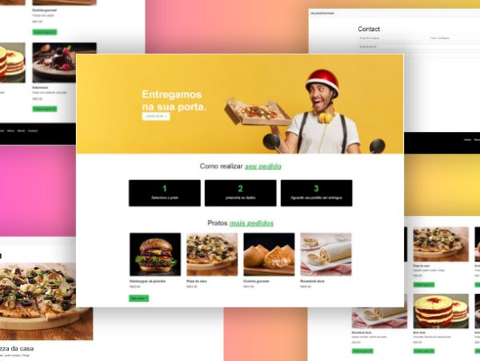

# Sistema de Delivery de Comida com Angular 16

Este é um sistema de delivery de comida desenvolvido com Angular 16, permitindo aos usuários visualizar pratos disponíveis, fazer pedidos e entrar em contato com a empresa.

## Tecnologias Utilizadas

- **Angular 16:** Framework front-end robusto e poderoso para desenvolver aplicações web escaláveis e de alto desempenho.
- **TypeScript:** Linguagem de programação fortemente tipada que compila para JavaScript, proporcionando segurança e legibilidade ao código.
- **HTML e CSS:** Linguagens padrão para marcação e estilização de páginas web.
- **Angular Material:** Conjunto de componentes e temas que seguem os princípios do Material Design, proporcionando uma interface de usuário consistente e agradável.

## Funcionalidades Principais

1. **Visualização de Pratos:** Os usuários podem navegar e visualizar uma lista de pratos disponíveis para pedido, juntamente com detalhes como nome, descrição, preço e imagem.
2. **Realização de Pedidos:** Os usuários podem selecionar os pratos desejados e adicioná-los ao carrinho de compras, inserindo suas informações pessoais para finalizar o pedido.
3. **Contato:** O formulário de contato permite aos usuários enviar mensagens à empresa, fornecendo seus nomes, sobrenomes, e-mails e números de telefone.

## Como Executar o Projeto Localmente

1. **Pré-requisitos:** Certifique-se de ter o Node.js e o Angular CLI instalados em sua máquina.
2. **Clone o Repositório:** Execute `git clone https://github.com/euramondiaz/restaurant-orders-ang-16.git` no seu terminal.
3. **Instale as Dependências:** Navegue até o diretório do projeto e execute `npm install` para instalar todas as dependências.
4. **Inicie o Servidor de Desenvolvimento:** Execute `ng serve` para iniciar o servidor de desenvolvimento. Navegue para `http://localhost:4200/` em seu navegador para visualizar o projeto.

## Contribuição

Sinta-se à vontade para contribuir com este projeto! Se você encontrar problemas, bugs ou tiver ideias para melhorias, abra uma issue ou envie um pull request.

## Autor

Este projeto foi desenvolvido por [RAMON DIAS](https://github.com/euramondiaz).
